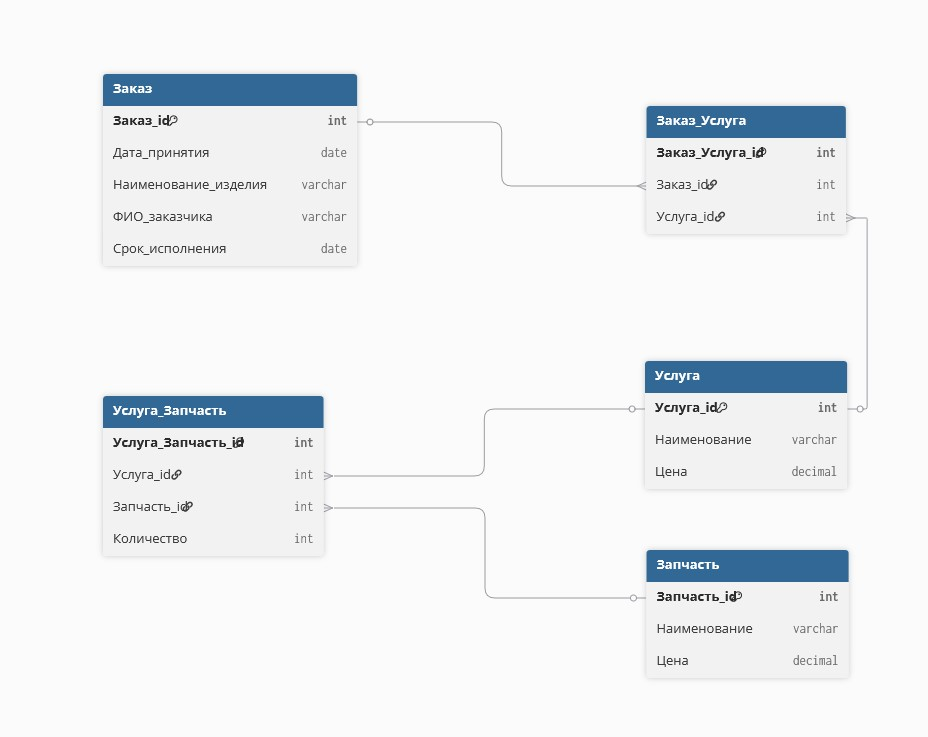

# Лабораторная работа 1

## Ремонт бытовой техники. (вариант 3)
Имеются заказы на ремонт изделий (номер заказа, дату принятия,
наименование изделия, ФИО заказчика и срок исполнения), перечень услуг
по ремонту (наименование, цена) и запчасти к изделиям (наименование,
цена). Для каждого заказа возможно выполнение нескольких видов услуг, а
каждая услуга может требовать применения нескольких видов запчастей в
определенном количестве.
**Выходные документы:**
- для заданного заказа выдать информацию о составляющих ее
  услугах, упорядочив ее по наименованиям услуг, с указанием
  видов запчастей каждой услуги с указанием их количества;
- выдать список заказов, принятых на заданную дату, с указанием
  наименования изделия и суммы каждого заказа,
  отсортированный по наименованию изделия. Сумма
  определяется услугами, входящими в состав заказа, и запчастями,
  необходимыми для их выполнения.

**Er-Диаграмма**

