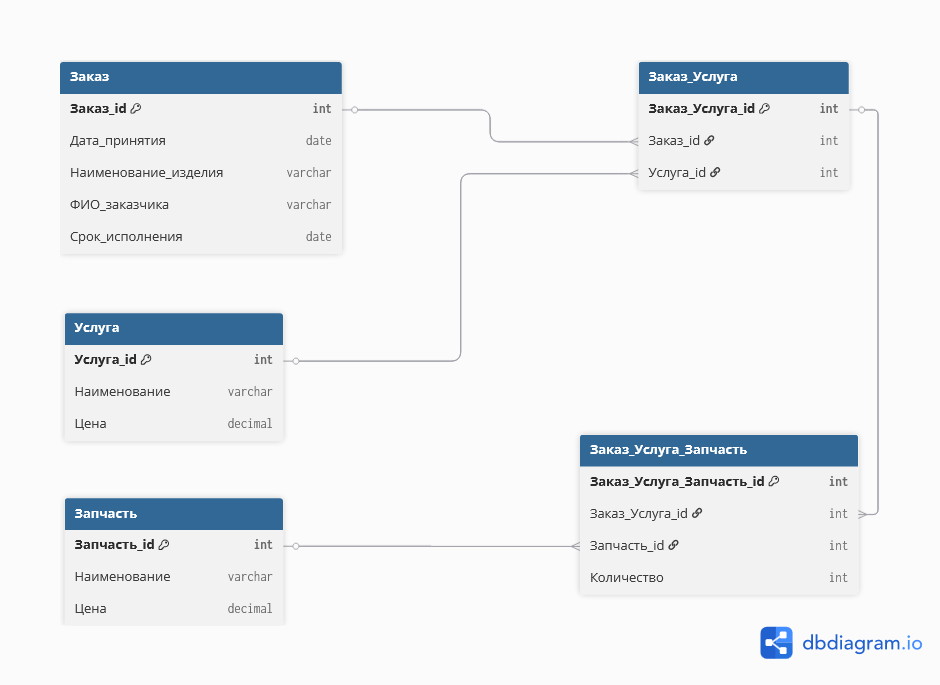

# Лабораторная работа 1

## Ремонт бытовой техники. (вариант 3)
Имеются заказы на ремонт изделий (номер заказа, дату принятия,
наименование изделия, ФИО заказчика и срок исполнения), перечень услуг
по ремонту (наименование, цена) и запчасти к изделиям (наименование,
цена). Для каждого заказа возможно выполнение нескольких видов услуг, а
каждая услуга может требовать применения нескольких видов запчастей в
определенном количестве.
**Выходные документы:**
- для заданного заказа выдать информацию о составляющих ее
  услугах, упорядочив ее по наименованиям услуг, с указанием
  видов запчастей каждой услуги с указанием их количества;
- выдать список заказов, принятых на заданную дату, с указанием
  наименования изделия и суммы каждого заказа,
  отсортированный по наименованию изделия. Сумма
  определяется услугами, входящими в состав заказа, и запчастями,
  необходимыми для их выполнения.

**Er-Диаграмма**



# Лабораторная работа 2

## Логическая модель

### Сущность «Заказ»
Сущность описывает факт приема изделия на ремонт.
**Назначение:** хранение основной информации о заказах на ремонт бытовой техники.
**Атрибуты:**
- `Заказ_id` - уникальный идентификатор заказа  
- `Дата_принятия` - дата приема изделия в ремонт  
- `Наименование_изделия` - наименование ремонтируемого изделия  
- `ФИО_заказчика` - данные заказчика  
- `Срок_исполнения` - планируемая дата окончания ремонта  
**Первичный ключ:** `Заказ_id`

### Сущность «Услуга»
Сущность описывает виды услуг, которые могут выполняться в рамках заказа.
**Назначение:** используется как справочник услуг.
**Атрибуты:**
- `Услуга_id` - уникальный идентификатор услуги  
- `Наименование` - наименование услуги  
- `Цена` - стоимость услуги  
**Первичный ключ:** `Услуга_id`

### Сущность «Запчасть»
Сущность описывает запасные части, применяемые при ремонте.
**Назначение:** используется как справочник запчастей.
**Атрибуты:**
- `Запчасть_id` - уникальный идентификатор запчасти  
- `Наименование` - наименование запчасти  
- `Цена` - стоимость одной единицы запчасти  
**Первичный ключ:** `Запчасть_id`

### Ассоциативная сущность «Заказ_Услуга»
Сущность реализует связь многие-ко-многим между заказами и услугами.
**Назначение:** хранение информации о перечне услуг, выполняемых в рамках конкретного заказа.
**Атрибуты:**
- `Заказ_Услуга_id` - уникальный идентификатор записи  
- `Заказ_id` - ссылка на заказ  
- `Услуга_id` - ссылка на услугу  

**Ключи:**
- Первичный ключ: `Заказ_Услуга_id`  
- Внешние ключи:
  - `Заказ_id` -> `Заказ`
  - `Услуга_id` -> `Услуга`


### Ассоциативная сущность «Заказ_Услуга_Запчасть»
Сущность описывает использование запчастей при выполнении конкретной услуги в заказе.
**Назначение:** хранение информации о том, какие запчасти и в каком количестве используются при выполнении услуги в конкретном заказе.
**Атрибуты:**
- `Заказ_Услуга_Запчасть_id` - уникальный идентификатор записи  
- `Заказ_Услуга_id` - ссылка на услугу в рамках заказа  
- `Запчасть_id` - ссылка на запчасть  
- `Количество` - количество запчастей данного вида  

**Ключи:**
- Первичный ключ: `Заказ_Услуга_Запчасть_id`  
- Внешние ключи:
  - `Заказ_Услуга_id` -> `Заказ_Услуга`
  - `Запчасть_id` -> `Запчасть`

### Связи между сущностями
- Заказ — Заказ_Услуга: связь один-ко-многим  
- Услуга — Заказ_Услуга: связь один-ко-многим  
- Заказ_Услуга — Заказ_Услуга_Запчасть: связь один-ко-многим  
- Запчасть — Заказ_Услуга_Запчасть: связь один-ко-многим  

## Физическая модель

```sql
CREATE TABLE Заказ (
    Заказ_id SERIAL PRIMARY KEY,
    Дата_принятия DATE NOT NULL,
    Наименование_изделия VARCHAR(255) NOT NULL,
    ФИО_заказчика VARCHAR(255) NOT NULL,
    Срок_исполнения DATE NOT NULL
);

CREATE TABLE Услуга (
    Услуга_id SERIAL PRIMARY KEY,
    Наименование VARCHAR(255) NOT NULL,
    Цена NUMERIC(10,2) NOT NULL
);

CREATE TABLE Запчасть (
    Запчасть_id SERIAL PRIMARY KEY,
    Наименование VARCHAR(255) NOT NULL,
    Цена NUMERIC(10,2) NOT NULL
);

CREATE TABLE Заказ_Услуга (
    Заказ_Услуга_id SERIAL PRIMARY KEY,
    Заказ_id INT NOT NULL REFERENCES Заказ(Заказ_id),
    Услуга_id INT NOT NULL REFERENCES Услуга(Услуга_id)
);

CREATE TABLE Заказ_Услуга_Запчасть (
    Заказ_Услуга_Запчасть_id SERIAL PRIMARY KEY,
    Заказ_Услуга_id INT NOT NULL REFERENCES Заказ_Услуга(Заказ_Услуга_id),
    Запчасть_id INT NOT NULL REFERENCES Запчасть(Запчасть_id),
    Количество INT NOT NULL
);
```