# Лабораторная работа 1

## Ремонт бытовой техники. (вариант 3)
Имеются заказы на ремонт изделий (номер заказа, дату принятия,
наименование изделия, ФИО заказчика и срок исполнения), перечень услуг
по ремонту (наименование, цена) и запчасти к изделиям (наименование,
цена). Для каждого заказа возможно выполнение нескольких видов услуг, а
каждая услуга может требовать применения нескольких видов запчастей в
определенном количестве.
**Выходные документы:**
- для заданного заказа выдать информацию о составляющих ее
  услугах, упорядочив ее по наименованиям услуг, с указанием
  видов запчастей каждой услуги с указанием их количества;
- выдать список заказов, принятых на заданную дату, с указанием
  наименования изделия и суммы каждого заказа,
  отсортированный по наименованию изделия. Сумма
  определяется услугами, входящими в состав заказа, и запчастями,
  необходимыми для их выполнения.

**Er-Диаграмма**

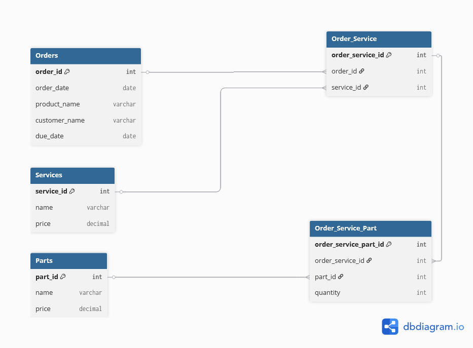

# Лабораторная работа 2

## Логическая модель
### Сущность Orders
Сущность описывает факт приема изделия на ремонт.
Назначение: хранение основной информации о заказах на ремонт бытовой техники.
Атрибуты:
- order_id - уникальный идентификатор заказа  
- order_date - дата приема изделия в ремонт  
- product_name - наименование ремонтируемого изделия  
- customer_name - данные заказчика  
- due_date - планируемая дата окончания ремонта, значение может быть только, как order_date либо больше   
Первичный ключ: order_id

### Сущность Services
Сущность описывает виды услуг, которые могут выполняться в рамках заказа.
Назначение: используется как справочник услуг.
Атрибуты:
- service_id - уникальный идентификатор услуги  
- name - наименование услуги  
- price - стоимость услуги, может быть только положительной 
Первичный ключ: service_id

### Сущность Parts
Сущность описывает запасные части, применяемые при ремонте.
Назначение: используется как справочник запчастей.
Атрибуты:
- part_id - уникальный идентификатор запчасти  
- name - наименование запчасти, должно быть уникально
- price - стоимость одной единицы запчасти  
Первичный ключ: part_id

### Ассоциативная сущность Order_Service
Сущность реализует связь многие-ко-многим между заказами и услугами.
Назначение: хранение информации о перечне услуг, выполняемых в рамках конкретного заказа.
Атрибуты:
- order_service_id - уникальный идентификатор записи  
- order_id - ссылка на заказ  
- service_id - ссылка на услугу  

Ключи:
- Первичный ключ: order_service_id  
- Внешние ключи:
  - order_id -> Orders
  - service_id -> Services

### Ассоциативная сущность Order_Service_Part
Сущность описывает использование запчастей при выполнении конкретной услуги в заказе.
Назначение: хранение информации о том, какие запчасти и в каком количестве
используются при выполнении услуги в конкретном заказе.
Атрибуты:
- order_service_part_id - уникальный идентификатор записи  
- order_service_id - ссылка на услугу в рамках заказа  
- part_id - ссылка на запчасть  
- quantity - количество запчастей данного вида  

Ключи:
- Первичный ключ: order_service_part_id  
- Внешние ключи:
  - order_service_id -> Order_Service
  - part_id -> Parts

### Связи между сущностями
- Orders - Order_Service: связь один-ко-многим  
- Services - Order_Service: связь один-ко-многим  
- Order_Service - Order_Service_Part: связь один-ко-многим  
- Parts - Order_Service_Part: связь один-ко-многим  

## Физическая модель
```sql
CREATE TABLE Orders (
    order_id SERIAL PRIMARY KEY,
    order_date DATE NOT NULL,
    product_name VARCHAR(255) NOT NULL,
    customer_name VARCHAR(255) NOT NULL,
    due_date DATE NOT NULL,
    
    CONSTRAINT chk_order_dates CHECK (due_date >= order_date)
);
CREATE TABLE Services (
    service_id SERIAL PRIMARY KEY,
    name VARCHAR(255) UNIQUE NOT NULL,
    price NUMERIC(10,2) NOT NULL,

    CONSTRAINT chk_service_price CHECK (price>0)
);
CREATE TABLE potaskuev2262.Parts (
    part_id SERIAL PRIMARY KEY,
    name VARCHAR(255) UNIQUE NOT NULL,
    price NUMERIC(10,2) NOT NULL,
    
    CONSTRAINT chk_part_price CHECK (price>0)
);

CREATE TABLE Order_Service (
    order_service_id SERIAL PRIMARY KEY,
    order_id INT NOT NULL REFERENCES Orders(order_id),
    service_id INT NOT NULL REFERENCES Services(service_id)
    
    UNIQUE (order_id, service_id)
);

CREATE TABLE Order_Service_Part (
    order_service_part_id SERIAL PRIMARY KEY,
    order_service_id INT NOT NULL REFERENCES Order_Service(order_service_id),
    part_id INT NOT NULL REFERENCES Parts(part_id),
    quantity INT NOT NULL
    
    CONSTRAINT chk_part_quantity CHECK (quantity>0),
    UNIQUE (order_service_id, part_id)
);
```

## DDL запросы
### Создаем таблицы
#### Orders:
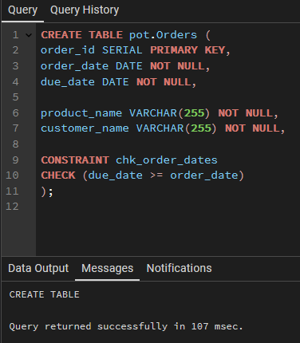
#### Services:
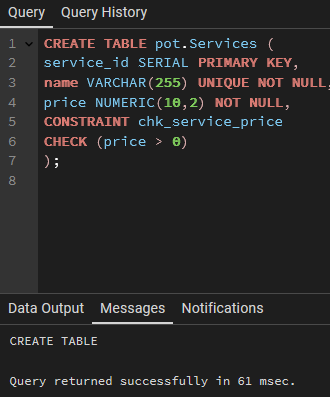
#### Parts:
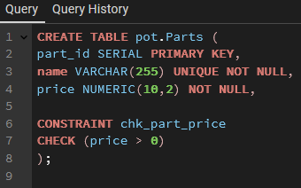
#### Order_Service:
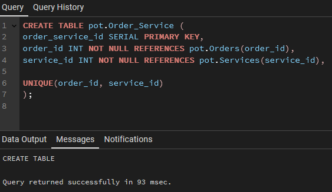
#### Order_Service_Part:
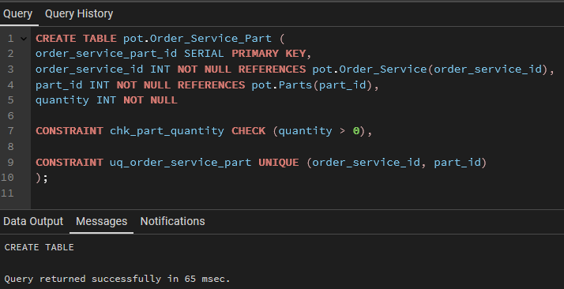

### Заполняем таблицы данными
#### Orders:
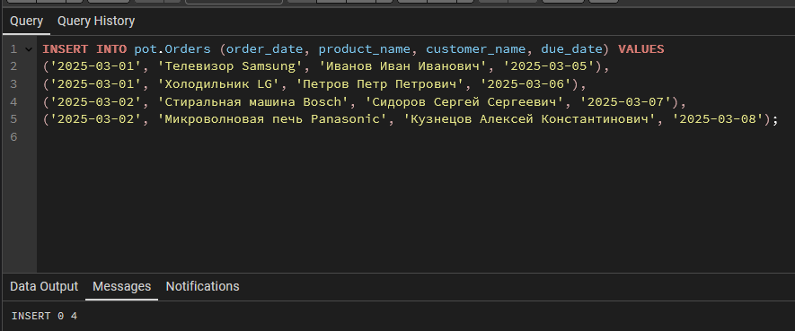
#### Services:
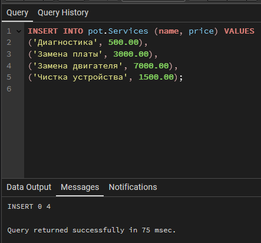
#### Parts:
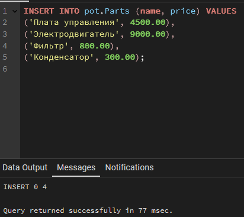
#### Order_Service:
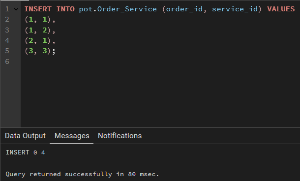
#### Order_Service_Part:
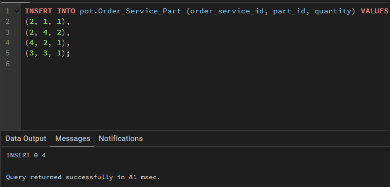

## SELECT запросы
Для заданного заказа:
услуги + запчасти + количество
отсортировано по наименованию услуги
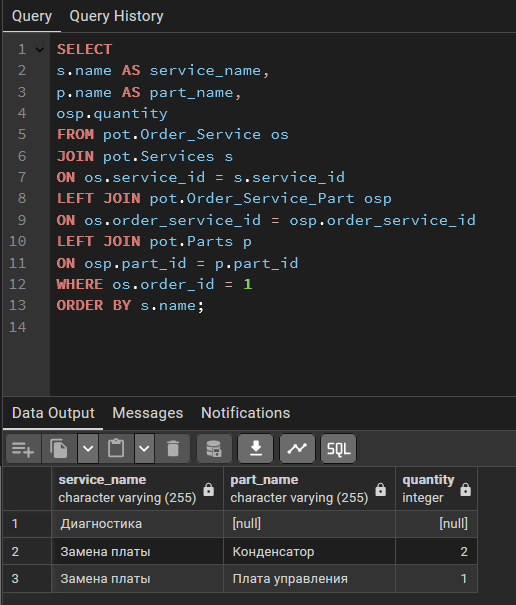

Список заказов за заданную дату (2025-03-01)
с суммой заказа, отсортировано по изделию
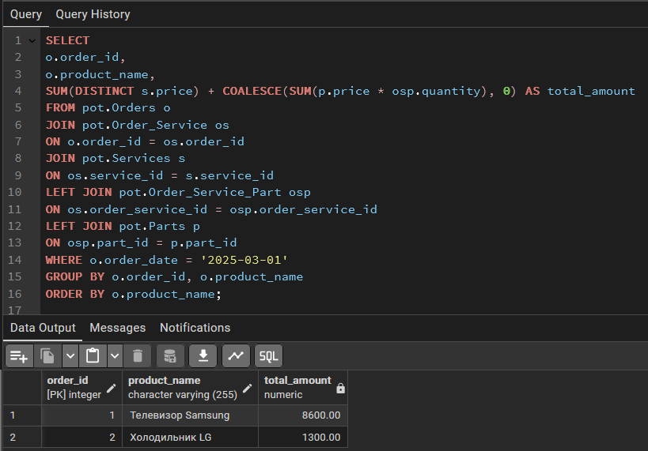

# Лабораторная работа 3

## Создание представлений для выходных документов
Напишем представления для выходных документов из прошлой работы: 
### Для первого документа
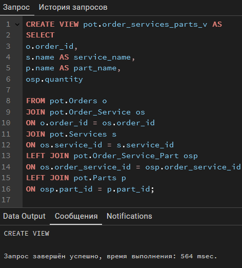
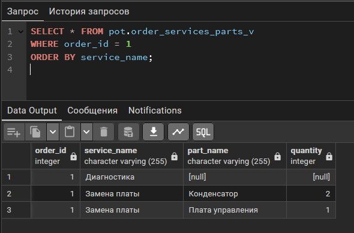
### Для второго документа
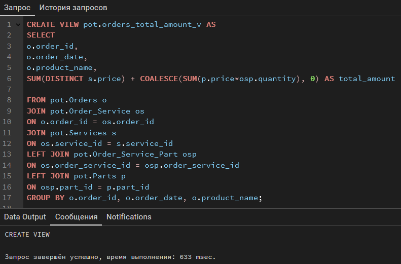
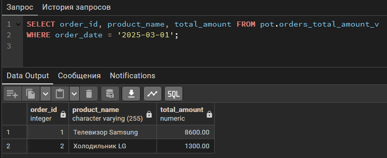

Теперь выходные документы формируются простыми SELECT, сложная логика скрыта внутри VIEW.

## Создание процедур
### Для первого документа
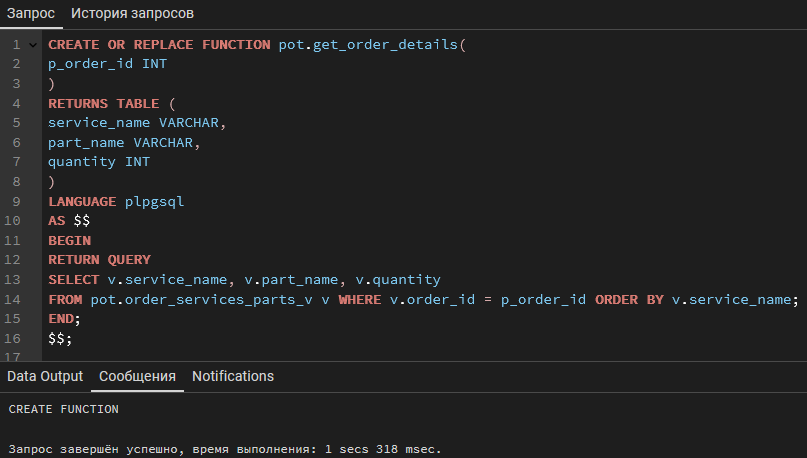
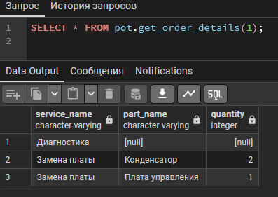
### Для второго документа
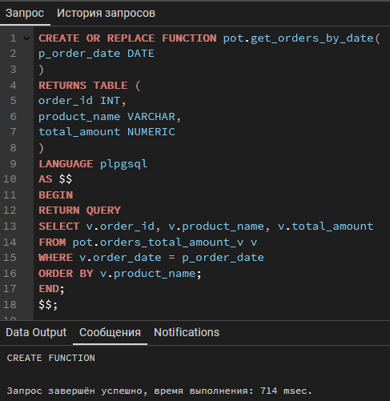
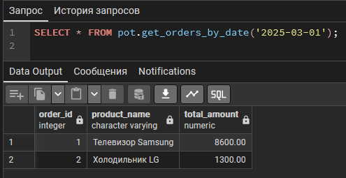

